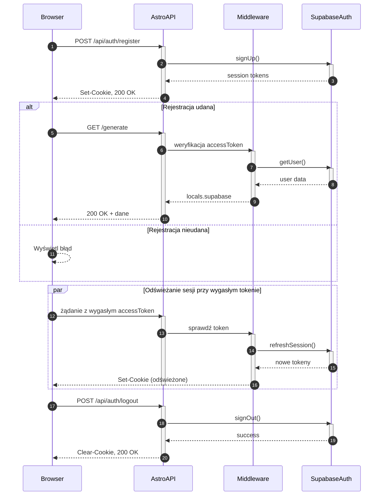

<authentication_analysis>

1. Przepływy autentykacji:

- Rejestracja (signUp) – US-001
- Logowanie (signIn) – US-002
- Wylogowanie (signOut)
- Zapomniane hasło (resetPasswordForEmail) – US-?
- Reset hasła (updateUser) z tokenem

2. Aktorzy i interakcje:

- Browser wysyła żądania do AstroAPI (endpointy /api/auth/)
- AstroAPI korzysta z Middleware do weryfikacji tokenów
- Middleware komunikuje się z Supabase Auth
- Supabase Auth zwraca dane sesji lub błędy

3. Weryfikacja i odświeżanie tokenów:

- Middleware sprawdza accessToken z cookie
- Przy wygasłym tokenie wywołuje refreshSession()
- Nowe tokeny zapisuje w cookies

4. Opis kroków:

- signUp: email+hasło → SupabaseAuth → sesja
- signIn: email+hasło → SupabaseAuth → sesja
- refreshSession: refreshToken → SupabaseAuth → nowe sesje
- getUser: accessToken → SupabaseAuth → dane użytkownika
- signOut: usuwa sesję w SupabaseAuth i czyści cookie
  </authentication_analysis>

<mermaid_diagram>

</mermaid_diagram>
