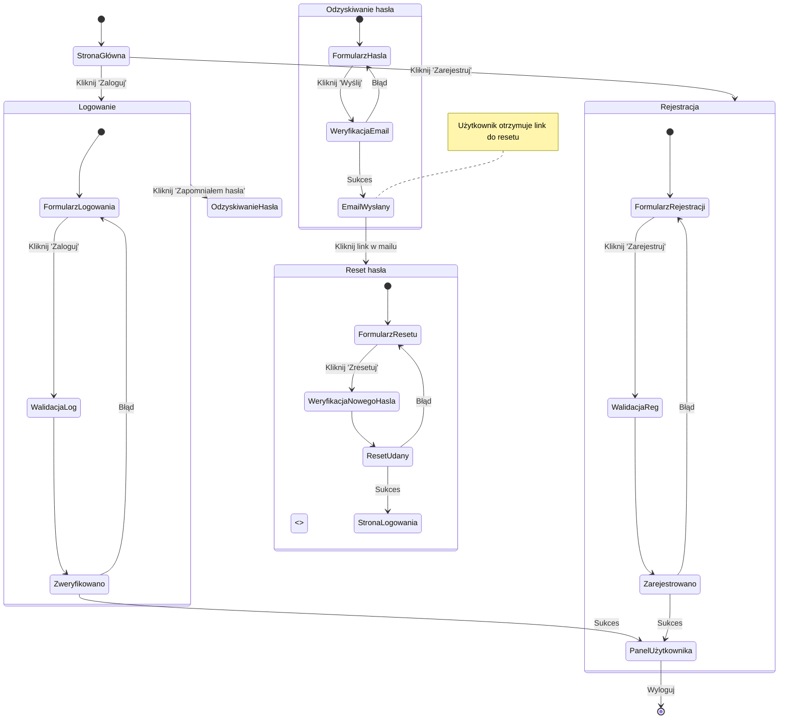

<user_journey_analysis>

1. Ścieżki użytkownika:

   - StronaGłówna → Logowanie → PanelUżytkownika
   - StronaGłówna → Rejestracja → PanelUżytkownika
   - StronaGłówna → Logowanie → OdzyskiwanieHasła → ResetHasła → StronaLogowania

2. Główne podróże i stany:

   - StronaGłówna: wybór akcji
   - Logowanie: formularz logowania
   - Rejestracja: formularz rejestracji
   - OdzyskiwanieHasła: formularz zapomnianego hasła
   - ResetHasła: ustawienie nowego hasła
   - PanelUżytkownika: dostęp do funkcji aplikacji

3. Punkty decyzyjne i ścieżki alternatywne:

   - Walidacja formularzy (sukces/błąd)
   - Weryfikacja tokena (poprawny/błędny)
   - Link 'Zapomniałem hasła' prowadzi do odzyskiwania

4. Cel każdego stanu:
   - StronaGłówna: start podróży
   - Logowanie: uwierzytelnienie użytkownika
   - Rejestracja: tworzenie nowego konta
   - OdzyskiwanieHasła: inicjacja resetu hasła
   - ResetHasła: przywrócenie dostępu po resetowaniu
   - PanelUżytkownika: kontynuacja pracy w aplikacji
     </user_journey_analysis>

<mermaid_diagram>

