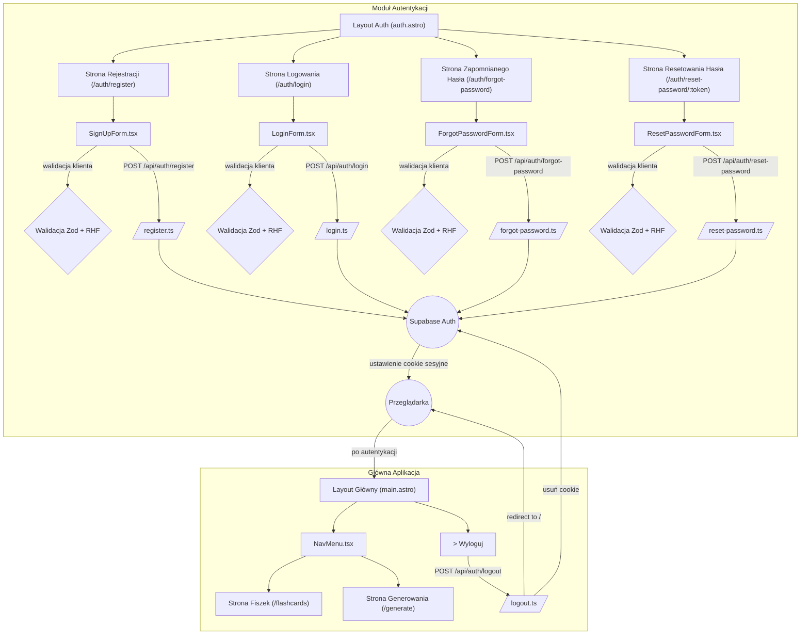

<architecture_analysis>

1. Wszystkie komponenty:

- `src/layouts/auth.astro` – layout dla stron publicznych: rejestracja, logowanie, odzyskiwanie hasła.
- `src/layouts/main.astro` – główny layout dla aplikacji po zalogowaniu, zawiera nawigację.
- `src/pages/auth/register.astro` – strona rejestracji.
- `src/pages/auth/login.astro` – strona logowania.
- `src/pages/auth/forgot-password.astro` – strona „zapomniałem hasła”.
- `src/pages/auth/reset-password/[token].astro` – strona resetowania hasła po tokenie.
- `src/components/auth/SignUpForm.tsx` – formularz rejestracji użytkownika.
- `src/components/auth/LoginForm.tsx` – formularz logowania.
- `src/components/auth/ForgotPasswordForm.tsx` – formularz wysyłki linku resetującego hasło.
- `src/components/auth/ResetPasswordForm.tsx` – formularz ustawiania nowego hasła.
- `src/components/ui/NavMenu.tsx` – komponent nawigacji reagujący na stan zalogowania.
- API endpoints w `src/pages/api/auth/`:
  - `register.ts`, `login.ts`, `logout.ts`, `forgot-password.ts`, `reset-password.ts`.
- `src/middleware/index.ts` – middleware weryfikujący sesję i zarządzający przekierowaniami.
- `src/db/supabase.client.ts` – klient Supabase do operacji Auth.

2. Główne strony i odpowiadające im komponenty:

- Strony autentykacji (`register.astro`, `login.astro`, `forgot-password.astro`, `reset-password/[token].astro`) używają `auth.astro` oraz odpowiednich formularzy React.
- Po autentykacji użytkownik trafia do stron `/flashcards` i `/generate`, korzystających z `main.astro` i `NavMenu`.
- Strona główna (`index.astro`) i layout główny.

3. Przepływ danych:

- Użytkownik wypełnia formularz (komponent React) → walidacja Zod + React Hook Form → wysłanie żądania HTTP (POST) do odpowiedniego endpointa API → middleware ładuje `locals.supabase` → endpoint używa `supabase.auth` do rejestracji/logowania/resetu hasła → Supabase Auth zwraca sesję (cookie) → przeglądarka zapisuje cookie → po zalogowaniu następuje redirect do `/generate`.

4. Opis funkcjonalności:

- `auth.astro` – layout z headerem i footerem dla formularzy autentykacji.
- `SignUpForm` – obsługa rejestracji, walidacja, wywołanie `/api/auth/register`.
- `LoginForm` – obsługa logowania, walidacja, wywołanie `/api/auth/login`.
- `ForgotPasswordForm` – obsługa wysyłki maila resetującego, wywołanie `/api/auth/forgot-password`.
- `ResetPasswordForm` – walidacja nowego hasła, wywołanie `/api/auth/reset-password`.
- `main.astro` – główny layout po zalogowaniu, pokazuje `NavMenu`.
- `NavMenu` – toggluje linki oraz przycisk wylogowania w zależności od sesji.
- Endpointy API – parsują i walidują dane, korzystają z Supabase Auth i zarządzają cookie.
- `middleware/index.ts` – weryfikuje sesję cookie i zabezpiecza dostęp do chronionych stron.
  </architecture_analysis>

<mermaid_diagram>

</mermaid_diagram>
