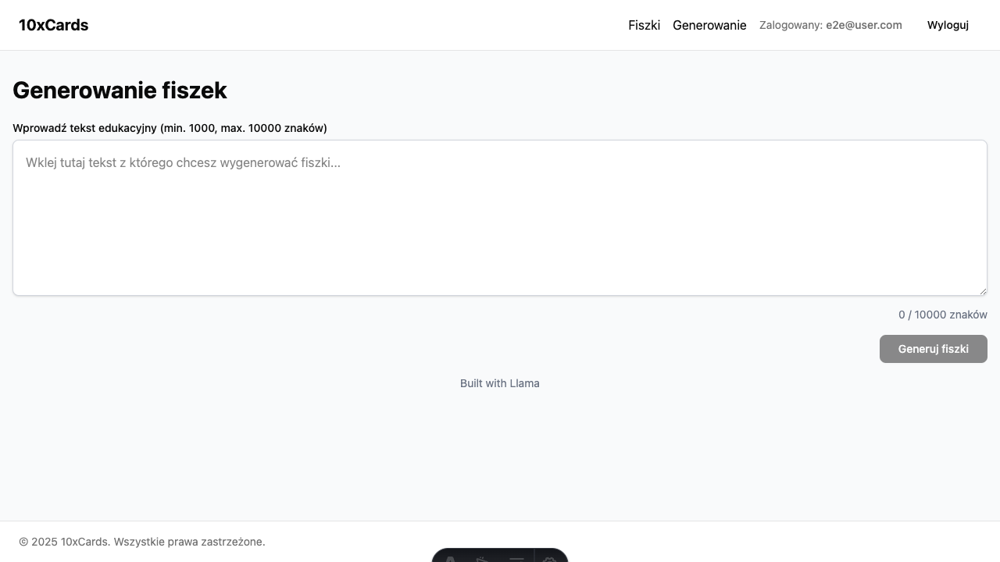

#  10x-cards.test

## ✨ Overview

10x-cards is an AI-powered flashcard generator designed to simplify the creation and management of educational flashcards. It leverages advanced language models via Openrouter.ai to automatically generate flashcard suggestions from user-provided text, saving time and effort in content creation.



### 💡 Key Information

- **🚀 Live App:** [https://10x-cards-4sq.pages.dev](https://10x-cards-4sq.pages.dev)
- **🧠 AI Model:** Built with Llama (meta-llama/llama-4-scout:free)

## 📖 Table of Contents

- [Tech Stack](#-tech-stack)
- [Prerequisites](#-prerequisites)
- [Getting Started](#-getting-started)
- [Available Scripts](#-available-scripts)
- [Project Structure](#-project-structure)
- [Testing](#-testing)
- [Deployments & Hosting](#-deployments--hosting)
- [AI Development Support](#-ai-development-support)
- [Contributing](#-contributing)
- [License](#-license)

## 💻 Tech Stack

[](https://skillicons.dev)

- [Astro](https://astro.build/) v5 - Modern web framework for building fast, content-focused websites
- [React](https://react.dev/) v19 - UI library for building interactive components
- [TypeScript](https://www.typescriptlang.org/) v5 - Type-safe JavaScript
- [Tailwind CSS](https://tailwindcss.com/) v4 - Utility-first CSS framework
- [Shadcn/ui](https://ui.shadcn.com/) - Re-usable components built using Radix UI and Tailwind CSS
- **Backend:**
  - [Supabase](https://supabase.io/) - Open source Firebase alternative (PostgreSQL, Auth, Storage)
- **Testing:**
  - [Vitest](https://vitest.dev/) - Unit and integration testing framework with UI for debugging
  - [React Testing Library](https://testing-library.com/docs/react-testing-library/intro/) - Testing React components
  - [@testing-library/astro](https://github.com/testing-library/astro-testing-library) - Testing Astro components
  - [Playwright](https://playwright.dev/) - End-to-end testing with cross-browser support
  - [MSW (Mock Service Worker)](https://mswjs.io/) - API mocking for tests
  - [supabase-js-mock](https://github.com/happycollision/supabase-js-mock) - Mocking Supabase interactions
  - [ts-jest](https://kulshekhar.github.io/ts-jest/) - TypeScript integration for tests

## ✅ Prerequisites

- Node.js v22.14.0 (as specified in `.nvmrc`)
- npm (comes with Node.js)

## 🚀 Getting Started

1. Clone the repository:

```bash
git clone https://github.com/abialobrodzki/10x-cards.git
cd 10x-cards
```

2. Install dependencies:

```bash
npm install
```

3. Run the development server:

```bash
npm run dev
```

4. Build for production:

```bash
npm run build
```

## ⚙️ Available Scripts

- `npm run dev` - Start development server
- `npm run build` - Build for production
- `npm run preview` - Preview production build
- `npm run lint` - Run ESLint
- `npm run lint:fix` - Fix ESLint issues

## 📁 Project Structure

```md
.
├── src/
│ ├── layouts/ # Astro layouts
│ ├── pages/ # Astro pages
│ │ └── api/ # API endpoints
│ ├── middleware/ # Astro middleware
│ ├── db/ # Supabase clients and types
│ ├── types.ts # Shared types for backend and frontend (Entities, DTOs)
│ ├── components/ # Client-side components written in Astro (static) and React (dynamic)
│ │ └── ui/ # Client-side components from Shadcn/ui
│ ├── lib/ # Services and helpers
│ └── assets/ # Static assets
└── public/ # Public assets
└── src/test/ # Test files
│   ├── unit/ # Unit and integration tests
│   └── e2e/ # End-to-end tests
```

## 📦 Deployments & Hosting

The application is hosted on **Cloudflare Pages**, utilizing its support for Astro and serverless/edge functions to serve both static content and API endpoints (`src/pages/api`).

Continuous Integration and Continuous Deployment (CI/CD) are managed via **[GitHub Actions](https://github.com/abialobrodzki/10x-cards/actions)**, which automate the build and deployment process to Cloudflare Pages upon code changes.

## 🧠 AI Development Support

This project is configured with AI development tools to enhance the development experience, providing guidelines for:

- Project structure
- Coding practices
- Frontend development
- Styling with Tailwind
- Accessibility best practices
- Astro and React guidelines

### Cursor IDE

The project includes AI rules in `.cursor/rules/` directory that help Cursor IDE understand the project structure and provide better code suggestions.

## 🙌 Contributing

Please follow the AI guidelines and coding practices defined in the AI configuration files when contributing to this project.

## 📜 License

This project is licensed under the **MIT License**.

Llama 4 is licensed under the [Llama 4 License](https://github.com/meta-llama/llama-models/blob/main/models/llama4/LICENSE).

## 🧪 Testing

This document outlines the testing infrastructure and practices for the 10xCards project.

| Testing Type               | Tools                                              |
|----------------------------|----------------------------------------------------|
| Unit and Integration Testing | Vitest, React Testing Library, MSW, @testing-library/jest-dom |
| End-to-End Testing         | Playwright, Axe-core                               |

### Testing Structure

- `src/test/unit/`: Unit and integration tests
- `src/test/e2e/`: End-to-end tests
- `src/test/setup.ts`: Global test setup for Vitest

### Running Tests

| Test Type    | Description                      | Command                          |
|--------------|----------------------------------|----------------------------------|
| Unit Tests   | Run all unit tests               | `npm test`                       |
| Unit Tests   | Watch mode for development       | `npm run test:watch`             |
| Unit Tests   | Open UI for interactive testing  | `npm run test:ui`                |
| Unit Tests   | Generate coverage report         | `npm run test:coverage`          |
| E2E Tests    | Run all E2E tests                | `npm run test:e2e`               |
| E2E Tests    | Open UI for interactive E2E testing | `npm run test:e2e:ui`            |
| E2E Tests    | Debug mode with step-by-step execution | `npm run test:e2e:debug`         |
| E2E Tests    | Update screenshot baselines      | `npm run test:e2e -- --update-snapshots` |

### Setting up Local Environment for Testing

```bash
# run supabase locally
supabase start
supabase migration up
supabase stop

# run dev server locally
dev astro dev # for local dev in port 3000
# or
dev:e2e npm run dev astro dev -- --mode test --port4321 # for e2e tests in port 4321
```

### Unit Testing and E2E Testing Best Practices

| Unit Testing Best Practices             | E2E Testing Best Practices                      |
| :-------------------------------------- | :---------------------------------------------- |
| Use `test.each` for parameterized tests | Use the Page Object Model pattern for maintainable tests |
| Mock external dependencies              | Use locators for resilient element selection    |
| Focus on testing behavior, not implementation | Implement visual comparison with `expect(page).toHaveScreenshot()` |
| Use the smallest possible rendering scope | Use trace viewer for debugging test failures      |
| Keep tests isolated from each other     | Test accessibility with axe-core                |

### Common Issues

1. **Port conflicts**: If you encounter port conflicts running E2E tests while the dev server is running, kill the dev server first or modify the port in `playwright.config.ts`.

2. **Accessibility issues**: The E2E tests check for accessibility violations using axe-core. Currently, there are two issues detected:

   - Missing main landmark: Add a `<main>` tag to the page
   - Content not contained in landmarks: Ensure all content is within proper semantic HTML landmarks

3. **Screenshot tests**: Before running screenshot tests, you need to generate baseline screenshots with:
   ```bash
   npm run test:e2e -- --update-snapshots
   ```
   Then remove the `.skip` from the screenshot test.

<!--
TO DO:
Uwaga: Zauważyłem potencjalne duplikaty nazw plików (FlashcardItem.tsx, FlashcardList.tsx) na różnych poziomach zagnieżdżenia. Warto sprawdzić, czy to celowe, czy może pozostałość po refaktoryzacji.

--- NOTATKI ---

## Lokalne Środowisko Testowe (Local Testing Environment)

### Testowanie Emaili (MailHog)

Lokalna skrzynka mailowa do testowania emaili (np. reset hasła, rejestracja użytkownika):
[http://localhost:54324](http://localhost:54324)

### Testowanie Integracji z AI (AI Ingestion Testing)

Narzędzia do przekazywania informacji o projekcie do modeli AI:

**Przekazywanie repozytorium (Repository Ingestion):**
- [gitingest.com](https://gitingest.com/)
- Alternatywa (Alternative): [repomix.com](https://repomix.com/)

**Google AI Studio (Szeroki kontekst - Free Tier):**
[https://aistudio.google.com/](https://aistudio.google.com/)

**Anthropic Console (Poprawianie promptów - Wymaga doładowania):**
[https://console.anthropic.com/](https://console.anthropic.com/)

### Manualne Testowanie API (Manual API Testing)

**Zapytania SQL - Supabase (SQL Queries - Supabase)**

Wyłączanie RLS (Row Level Security) - tymczasowo do testów:
```sql
ALTER TABLE flashcards DISABLE ROW LEVEL SECURITY;
```

Włączanie RLS (Row Level Security) - wymaga autoryzacji:
```sql
ALTER TABLE flashcards ENABLE ROW LEVEL SECURITY;
```

**Polecenia cURL - Postman (cURL Commands - Postman)**

Generowanie fiszek - POST:
```bash
curl --location 'http://localhost:3000/api/generations/generate' \
--header 'Content-Type: application/json' \
--data '{
    "text": "Lorem ipsum dolor sit (...)"
}'
```

Pobieranie fiszek - GET:
```bash
curl --location 'http://localhost:3000/api/flashcards'
```

---

-->
